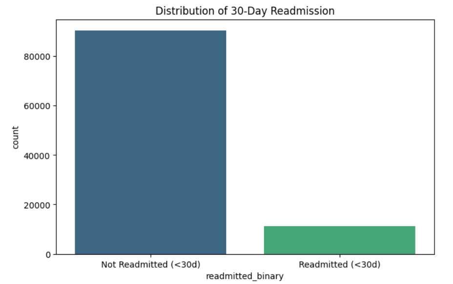
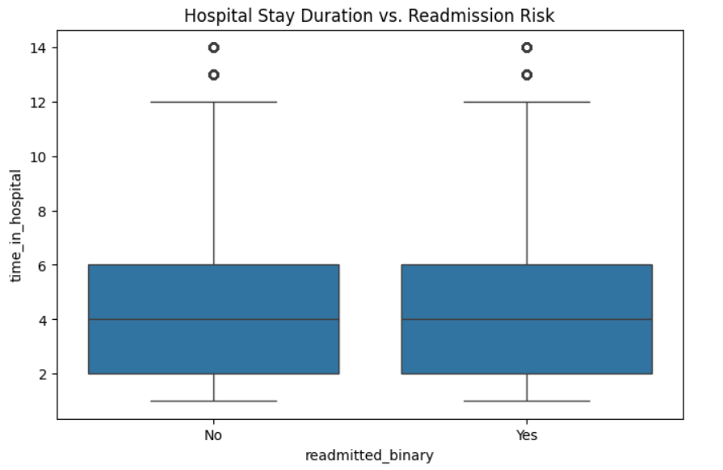
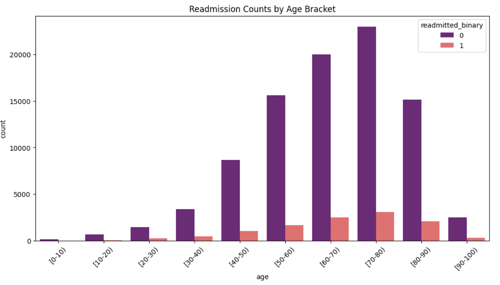
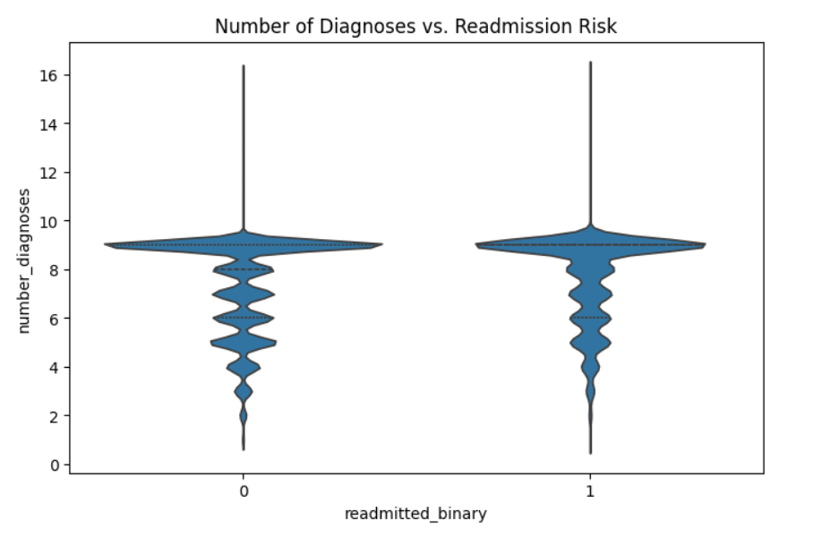

1. Research Question

Can we accurately predict whether a patient will be readmitted to the hospital within 30 days, and what specific patient groups are most at risk based on clustering analysis? Our goal is to build a classification model to identify high-risk individuals and use clustering to understand the common health profiles within those groups.

2. Dataset Overview & Source Legitimacy

Dataset Name: Diabetes 130-US hospitals dataset (1999-2008)

Source: UCI Machine Learning Repository.

Legitimacy: This is a de-identified, public clinical dataset originally used for peer-reviewed research. It contains no Protected Health Information (PHI) and is ethically appropriate for statistical modeling and academic use.

3. Variables, Target, and Preprocessing

Target Variable (readmitted_binary)

- 1 (High Risk): Readmitted within 30 days (<30).

- 0 (Low Risk): Readmitted after 30 days (>30) or not at all (NO).

Key Features

- age: Categorical 10-year age brackets.

- number_diagnoses: NumericTotal number of diagnoses entered into the system.

- time_in_hospital: NumericDays between admission and discharge.

- num_medications: NumericNumber of distinct generic names devised for the patient.

- Preprocessing & Missing Data: Our initial EDA revealed significant missing values (originally marked as ?).

- Excluded Features: weight (~98,000 missing), payer_code (~40,000), and medical_specialty (~50,000) will be dropped due to insufficient data.

- Cleaning: Rows with missing race or diagnosis codes (diag_1, diag_2, diag_3) will be removed, as they represent a small fraction of the total data.

- Encoding: We will use one-hot encoding for categorical variables and join the IDS_mapping.csv to interpret admission types correctly.

5. Summary Statistics & Visual Exploration

Visualization 1: Distribution of 30-Day Readmission (Count Plot)
This confirms a significant class imbalance. Roughly 11% of the dataset represents the target class (readmitted <30 days). This tells us that accuracy will not be a reliable metric, so we must prioritize the F1-score to ensure we aren't ignoring the high-risk patients.

Visualization 2: Hospital Stay Duration vs. Risk (Boxplot)
Interestingly, the median 'Time in Hospital' is nearly identical for both groups (around 3–4 days). This suggests that the length of the initial stay is not a strong standalone predictor for whether a patient will return within a month.

Visualization 3: Readmission Counts by Age Bracket
Our count plot shows that the vast majority of patients and readmissions occur in the 60–90 age range.
Age is a major demographic factor, but because the 'No' bars are also highest in these groups, age alone may not be the only predictor

Visualization 4: Number of Diagnoses vs. Risk
The violin plot indicates that patients who are readmitted (Class 1) have a higher density of records around 9 diagnoses.
Increased medical complexity (comorbidities) appears to correlate with a higher risk of 30-day readmission.

Summary:
Only about 11% of patients are readmitted within 30 days. We must use F1-score and AUC-ROC for evaluation, as accuracy will be misleadingly high if the model simply predicts 'No' for everyone.
While time_in_hospital showed similar distributions for both groups, number_diagnoses provides a clearer signal for distinguishing high-risk groups.

6. Reflection on Challenges

The primary challenge so far has been data cleaning and repository collaboration. Handling the ? values required careful decision-making on which features to keep versus drop.
Additionally, navigating GitHub permissions as a team was a learning curve; we had to set up a shared workflow to ensure our code remains reproducible. On the technical side, the ICD-9 diagnosis codes are extremely granular. Our next big step is grouping these 1,000+ codes into broader categories (like Circulatory or Metabolic) to make the model more interpretable and efficient.
