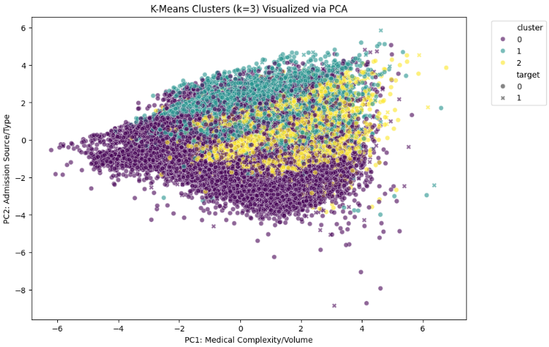

# Additional ML Method Choice and Implementation
We implemented K-Means Clustering as our additional machine learning method to identify natural patient profiles within the Diabetes 130-US Hospitals dataset. This unsupervised approach allows us to discover patient groupings based on clinical similarities, such as medical complexity and hospital volume, that may not be captured by supervised labels alone.

 To ensure a competent implementation, we performed the following technical steps:

- Feature Selection: We utilized the clinical features identified as important in our supervised models, including number_diagnoses, num_medications, and time_in_hospital.

- Data Scaling: We utilized a StandardScaler to normalize the data. This is a critical technical choice because K-Means is a distance-based algorithm; without scaling, features with larger ranges would disproportionately bias the clusters.

- Categorical Handling: We properly one-hot encoded categorical IDs (like admission and discharge types) so the model treats them as distinct categories rather than continuous numbers.

# Interpretation, Parameters, and Supporting Output

We utilized two primary metrics to determine the optimal number of clusters ($k$):

1. The Elbow Method: We observed a bend or elbow starting at $k=3$, indicating the point where increasing the number of clusters provides diminishing returns in error reduction.
 
2. Silhouette Score: To ensure computational efficiency on this large dataset, we calculated the score on a random sample of 5,000 rows. The score confirmed that $k=3$ provides a statistically sound balance of group separation.

## Because our clinical data contains over 10 dimensions, we used Principal Component Analysis (PCA) to project the results into a 2D space for visualization.

* PC1 (X-Axis): This axis represents Medical Complexity and Volume. Our PCA loadings show it is primarily driven by time_in_hospital, num_medications, and number_diagnoses.
* PC2 (Y-Axis): This axis represents the Admission Source and Type.

# Connection to Supervised Analysis and Final Conclusion

While our Random Forest model successfully identified what specific features were top predictors of readmission (such as number_inpatient), this Clustering method shows how those features manifest in real patient groups. It adds a layer of insight that prediction models alone cannot provide.
